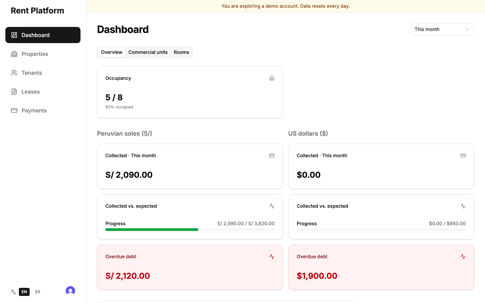

# Rent Platform

[🇪🇸 Leer en español](./README.es.md)

Rental management for landlords: properties, tenants, leases, monthly charges, partial payments, PDF receipts and WhatsApp reminders, in English and Spanish.

**Live demo:** [rent-platform-bdlc.vercel.app](https://rent-platform-bdlc.vercel.app) — click **Try the demo** to sign in to a sample account with one click, no password. The demo data resets every day.



## What it does

- **Properties and tenants.** Rooms and commercial units, priced in soles (S/) or US dollars.
- **Leases.** A lease claims an available property; terminating it frees the property again. Commercial leases also track water, electricity and gas.
- **Monthly charges.** A daily cron creates this month's charge for every active lease; landlords can also run it with a button. Running it twice never duplicates a charge.
- **Payments.** Record partial or full payments. Each charge shows whether it is paid, partial, pending or overdue, and how many days late.
- **Receipts and reminders.** Download a PDF receipt, or open WhatsApp with a confirmation or a reminder that includes the exact balance.
- **Dashboard.** Occupancy, money collected versus expected, and overdue debt, by period and by type of property.
- **Two languages.** The whole UI, the sign-in screens, the receipts and the WhatsApp messages switch between English and Spanish.

## How it's built

| Area | Choice |
| --- | --- |
| App | Next.js 16 (App Router, Server Components, Server Actions), React 19, TypeScript |
| Auth | Clerk. Every query and server action is scoped to the signed-in landlord; another landlord's record answers "not found". |
| Data | PostgreSQL on Neon, Prisma 7. Money is `Decimal(12,2)`, dates are `date` columns, payments are a table of transactions. |
| Validation | Zod schemas on every server action, with typed error codes the UI translates. |
| Billing logic | Pure functions in `lib/billing` that work in integer cents and ISO dates, with "today" in Lima time. |
| UI | Tailwind CSS 4, shadcn/ui (Radix), Storybook for the component library |
| Tests | Vitest for the billing, analytics, formatting and validation logic; Playwright end-to-end on desktop and mobile |
| Ops | Vercel, with two daily crons protected by `CRON_SECRET`; GitHub Actions for lint, types, tests and build |

```
app/
  page.tsx                 Public landing page
  (auth)/                  Clerk sign-in and sign-up
  (app)/                   Protected app: dashboard, properties, tenants, leases, payments
  demo/route.ts            One-click demo sign-in (Clerk sign-in token)
  api/cron/                Daily charges and demo reset
lib/
  billing/                 Money, dates and payment status (pure, unit-tested)
  actions/                 Server actions: auth check, Zod, Prisma
  data.ts                  Owner-scoped queries that return plain DTOs
  i18n/                    English and Spanish dictionaries
e2e/                       Playwright tests
prisma/                    Schema, migrations and the demo seed
```

## Running it locally

Requirements: Node.js 24, pnpm 10, a PostgreSQL database (Neon works) and a Clerk application.

```bash
pnpm install
cp .env.example .env.local   # then fill in the values
pnpm prisma migrate deploy
pnpm prisma:seed user_xxx    # optional: sample data for your Clerk user id
pnpm dev
```

## Tests

```bash
pnpm lint
pnpm typecheck
pnpm test            # unit tests (Vitest)
pnpm test:e2e        # end-to-end (Playwright); needs DATABASE_URL_TEST
pnpm storybook       # component library
```

The end-to-end suite runs against its own database (`DATABASE_URL_TEST`) and refuses to start without it. It signs in with Clerk test users and covers the whole landlord flow, invalid input, the sign-in guard, isolation between landlords, the one-click demo and the language switch.
